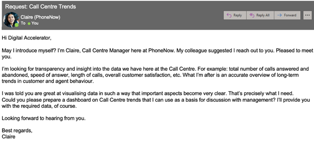
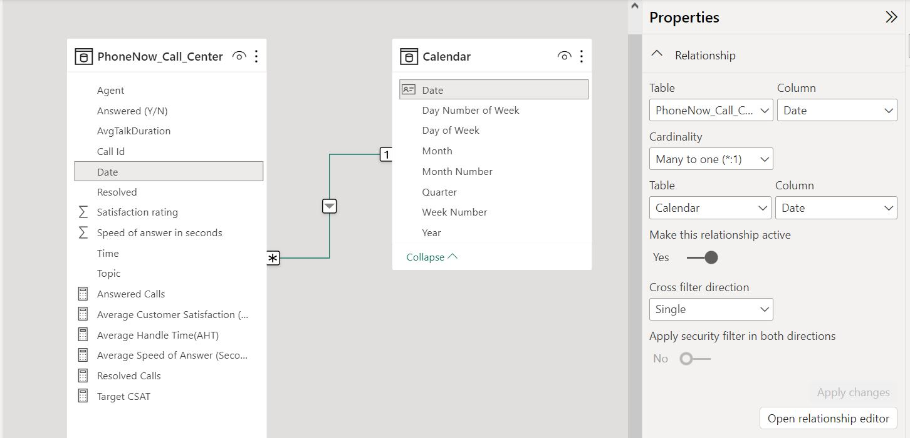
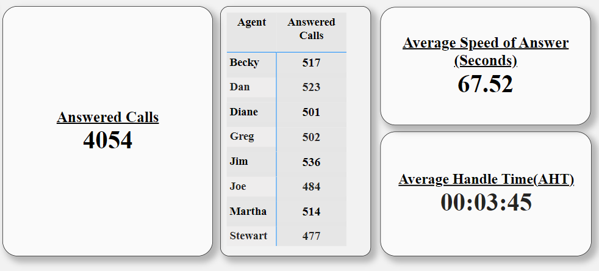
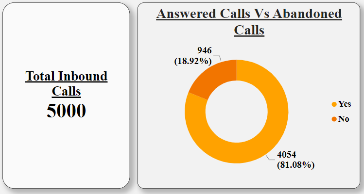
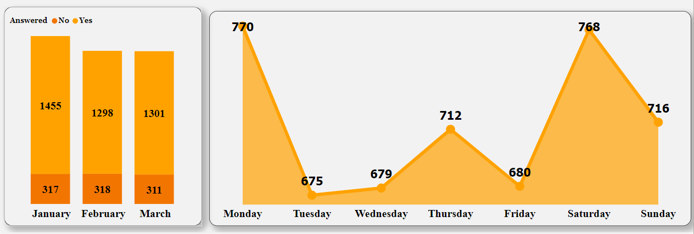
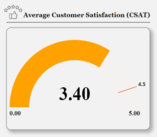
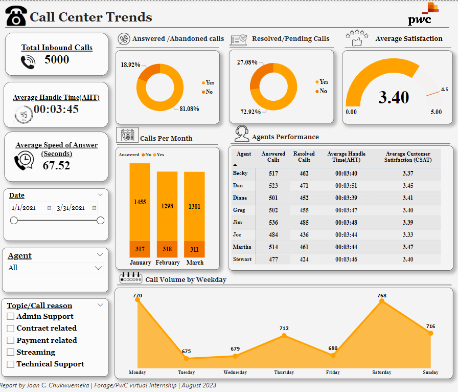

# Call-center-Trends


[Photo Credit](https://strongproject.com/office-furniture-blog/modern-call-center-designs-to-improve-performance/)

## Background
In telecom marketing, providing better prices and services to both small businesses and young urbanites can increase profitability. However, knowing what customers really want is pivotal in staying ahead of the competition as a Telecom Company. Our client from a big telecom company needs to know, and has reached out to Analyst Joan via the email below, to help him visualize their data. 


 
## About the Data
The dataset is a Microsoft Excel file that contains one table, consisting of **5000 rows and 10 columns** of the call records and customer ratings of **Phonenow Telecoms** for 3 months. The data was gotten from [Forage](https://cdn.theforage.com/vinternships/companyassets/4sLyCPgmsy8DA6Dh3/01%20Call-Center-Dataset.xlsx).   

## Client’s Need 
A Power BI dashboard that reflects all relevant Key Performance Indicators (KPIs) and metrics in the dataset, thereby visualising customer and agent behaviour.

## Target Audience
-	Claire, The Call Center Manager at PhoneNow Telecoms.

## Skills/Concepts applied
- Defining KPIs
-	Cleaning/Validation in Power Query
-	Power BI DAX Concepts: Calculated Measures
-	Data Visualization in Power BI
-	Power BI Dashboard building
-	Filters and Slicers.

## Defining Key Performance Indicators (KPIs)
The following metrics were identified as essential Key Performance Indicators (KPIs) to empower the call center manager with insights into both customer and agent behavior within the company.

**Indicators of customer behaviour.**
- Overall customer satisfaction (CSAT)– How does customers rate services provided by PhoneNow?
- Calls by time – quantity of calls per month and weekly.

**Indicators of agent behaviour.**
- Calls answered - How many calls did an agent respond to?
- Average speed of answer – How quickly did an agent respond to the call?
- Average handle time (AHT) – Talk duration of the customer’s call with the Agent
- Overall calls answered/abandoned – what’s the ratio of calls an agent responded to or missed/abandon?

## Data Transformation/Preprocessing
The dataset was imported into Power BI’s Power Query for data validation and cleaning.  The column profiling was changed from ‘based on Top 1000 rows’ to ‘based on entire dataset’. ‘Column quality’ and ‘Column distribution’ checkboxes were selected to get a summary information about each column for effective cleaning/Preprocessing. The process is as outlined below:
-	Column datatypes were validated appropriately.
-	The columns with date and time together were split to extract date part and for ease of date-based analysis.
-	Redundant/irrelevant columns from the split action were removed where applicable
-	Abbreviated contents were replaced with their respective full meaning e.g. “N” replaced with “NO”.
  
To enable flexibility of time-based analysis, a **Calendar Table** was then created in power query using the [M Query language](https://devinknightsql.com/2015/06/16/creating-a-date-dimension-with-power-query/) shown below: 
```
//Create Date Dimension
(StartDate as date, EndDate as date)=>

let
    //Capture the date range from the parameters
    StartDate = #date(Date.Year(StartDate), Date.Month(StartDate), 
    Date.Day(StartDate)),
    EndDate = #date(Date.Year(EndDate), Date.Month(EndDate), 
    Date.Day(EndDate)),

    //Get the number of dates that will be required for the table
    GetDateCount = Duration.Days(EndDate - StartDate),

    //Take the count of dates and turn it into a list of dates
    GetDateList = List.Dates(StartDate, GetDateCount, 
    #duration(1,0,0,0)),

    //Convert the list into a table
    DateListToTable = Table.FromList(GetDateList, 
    Splitter.SplitByNothing(), {"Date"}, null, ExtraValues.Error),

    //Create various date attributes from the date column
    //Add Year Column
    YearNumber = Table.AddColumn(DateListToTable, "Year", 
    each Date.Year([Date])),

    //Add Quarter Column
    QuarterNumber = Table.AddColumn(YearNumber , "Quarter", 
    each "Q" & Number.ToText(Date.QuarterOfYear([Date]))),

    //Add Week Number Column
    WeekNumber= Table.AddColumn(QuarterNumber , "Week Number", 
    each Date.WeekOfYear([Date])),

    //Add Month Number Column
    MonthNumber = Table.AddColumn(WeekNumber, "Month Number", 
    each Date.Month([Date])),

    //Add Month Name Column
    MonthName = Table.AddColumn(MonthNumber , "Month", 
    each Date.ToText([Date],"MMMM")),

    //Add Day of Week Column
    DayOfWeek = Table.AddColumn(MonthName , "Day of Week", 
    each Date.ToText([Date],"dddd")),

   //Add Day Number of Week Column
    DayNumberOfWeek = Table.AddColumn(DayOfWeek, "Day Number of Week", each Date.DayOfWeek([Date]) + 1)


in
    DayNumberOfWeek
```

## Data Modelling
The `date` column from the call center table was connected to the `date` column in the calendar table, via a Many-to-one relationship as shown in the image below:



## Data Exploration / KPI Visualization.
With the data now cleaned, it’s time to explore the data and visualize Agents and customers behaviour in response to the Client’s need. I started by creating the following DAX calculated measures to analyse Indicators of agent behaviour:
```
Answered Calls = CALCULATE(
                           COUNT(PhoneNow_Call_Center[Answered (Y/N)]),	
                                  PhoneNow_Call_Center[Answered (Y/N)] = "Yes")
```
```
Average Speed of Answer (Seconds) = CALCULATE(
                                              AVERAGE(PhoneNow_Call_Center[Speed of answer in seconds]), 
                                                      PhoneNow_Call_Center[Speed of answer in seconds] <> 0)
```

```
Average Handle Time(AHT) = FORMAT(
                                  CALCULATE(
                                            AVERAGE(PhoneNow_Call_Center[AvgTalkDuration]),      
                                                    PhoneNow_Call_Center[Answered (Y/N)] = "Yes"),
                                                    "HH:mm:ss")
```

The measures were then used with relevant records in the dataset to visualize the metrics as shown below:



From the above visual, a total of **4,054 calls were answered**, with each Agent handling over 450 calls. It also shows that agents take about **1 minute 7 seconds to respond to calls** from the customers and spend **over 3 minutes in handling the request/issues** from them. 
Based on domain knowledge, I see the long wait time before a call is responded to, i.e., Speed of answer, being likely responsible for Agents long talk duration (AHT), as customer may end up already irritated at the delay, and time will be spent to first pacify the customer before attending to the call reason. 

Furthermore, It will be beneficial to find out if all calls were answered or perhaps some were abandoned. Taking a count of all call records, we see that out of **5,000 inbound calls**, **81% were answered** and **19% were abandoned** as shown in the visual below. 
 

 
The reason(s) for call abandonment may need to be investigated further by the Management team as it can have a negative impact on customer satisfaction and the Net Promoter’s score.

Moving on, we will now assess how **PhoneNow** customers rate the telecom’s services and their preferred call periods. 
Using our `Month` and `day of week` categories from the calendar table, with the total inbound calls for the period of evaluation, we see that, for monthly records, the highest calls were recorded in **January**, whereas the weekly trend shows calls being high on **Mondays**, and **during the weekends**



Finally, we will now see how satisfied customers are with the services they received. To get the Average Customer Satisfaction rating, a DAX measure was created and CSAT Target Set to 4.5, as shown below:
```
Average Customer Satisfaction (CSAT) = CALCULATE(
                                                 AVERAGE(PhoneNow_Call_Center[Satisfaction rating]),
                                                         PhoneNow_Call_Center[Satisfaction rating] <> 0)
```
```
Target CSAT = 4.5
```

 

The visual above, shows the satisfaction rating of 3.40, which is below the target of 4.5. This is another area of concern for the call center manager and management team to look into, as customer satisfaction is key to every business growth.

## Dashboard:
Having identified & visualized the agents’ and customers’ behaviours, the dashboard shown below was then designed, to bring our visuals into a single page view for the Call Center Manager as requested.



## Conclusion
Insights and recommendation were not requested at this time, hence I designed an [interactive Dashboard]() to provide flexibility for Claire, the Call Center Manager, to enable him query varying metrics and be empowered to present the findings to the management team for discourse and further actions where required. 

Thank you.

